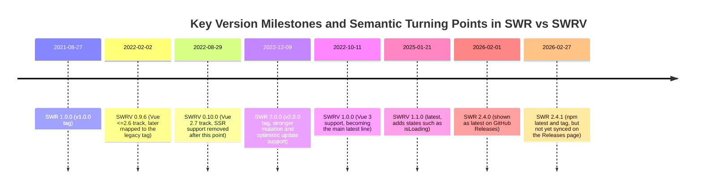

# A Study of Misalignment Between SWR (React) and SWRV (Vue) in API Design and Underlying Implementation (as of 2026-03-18)

## Executive Summary

This report compares SWR in the React ecosystem and SWRV in the Vue Composition API ecosystem through the core lens of "misalignment", examining differences in their public APIs, default behaviors, and internal mechanisms, and then proposes migration and alignment strategies based on those differences. The conclusion can be summarized as three layers of misalignment: the release surface, the API semantics surface, and the implementation mechanism surface.

On the release surface, SWR's "latest stable" is not defined consistently across channels. npm and Git tags show the latest version as 2.4.1, released on 2026-02-27, while the GitHub Releases page in this sample still shows 2.4.0 as the latest. The direct consequence is that behavior alignment based on release notes alone can leave gaps or lag behind reality. In practice, tags and npm should be treated as the primary factual baseline, with Releases used only as a secondary reference.

At the API semantics level, SWR has clearly moved toward a "modular incremental expansion" design. In addition to the core `useSWR`, it provides official standalone entry points for `mutation`, `subscription`, and `infinite`, and combines them with global `mutate`, a middleware system, and pluggable cache providers to form a composable capability model.  
By contrast, SWRV maintains a "Minimal API" tendency. Its core revolves around `useSWRV` and `mutate`, while also exposing TTL and "stale-if-error" as distinctive features. However, it lacks official specialized APIs equivalent to SWR's `useSWRInfinite`, `useSWRSubscription`, and `useSWRMutation`, which means more complex patterns must be assembled by users themselves. This creates inconsistencies in both semantics and behavior.

At the implementation mechanism level, SWR's key characteristic is that it maintains global state per cache provider. This state is used for deduplication, broadcasting, event-driven revalidation, and concurrent race avoidance. In particular, the deduplication and race-avoidance logic appears directly in the core implementation. Concurrent requests for the same key are coalesced into `FETCH[key]`, then cleaned up after `dedupingInterval`, while timestamp comparison ensures that a later request wins so older responses do not overwrite newer state.  
SWRV, on the other hand, leans more toward a "cache-like object with createdAt/expiresAt plus key serialization/hashing", and it exposes TTL explicitly at the product level. This leads SWRV and SWR down different philosophical paths regarding cache lifecycle and whether explicit invalidation is needed. At the same time, SWRV's official documentation explicitly states that SSR support was removed starting in 0.10.0, and issue discussions point out the risk that module-level global cache may be shared across requests. This creates a structural misalignment with the common SSR and SSG usage patterns seen in SWR.

Based on the differences above, this report proposes three categories of alignment strategy:  
The first is a shim adaptation layer, which wraps SWRV's `useSWRV` and `mutate` into an API shape closer to SWR and fills in semantic gaps such as `revalidate: false` and `optimisticData/rollbackOnError`. The second is behavior middleware, for example introducing TTL semantics into SWR via a custom provider or middleware to support applications migrating from SWRV. The third is context-injectable instantiation, which changes SWRV's global cache from a module singleton into an instance that can be injected per request, restoring SSR safety and moving closer to SWR's provider model.

## Versions and Release Surface

### Version Baseline Used in This Study

The user did not specify versions, so this report uses the verifiable latest stable versions available at the time of research, 2026-03-18 in Asia/Tokyo. However, the criteria for determining the stable version differ between SWR and SWRV and need to be stated separately.

For SWR, npm shows the latest version as 2.4.1, published on 2026-02-27.  
Git tags also show v2.4.1 dated 2026-02-27 and v2.4.0 dated 2026-02-01, and the v2.4.1 commit `5fa29522f196db2ad9d2083193c3b63214256c19` appears to be only a version bump from 2.4.0 to 2.4.1.  
However, at the time of capture, the GitHub Releases page still showed v2.4.0 as Latest and did not include v2.4.1.  
Therefore, for behavior and source analysis, this report uses tag `v2.4.1` as primary. For the release-note timeline, it uses Git tags and npm timestamps as primary, and the Releases page only as a supplementary reference.

For SWRV, npm shows `swrv@latest` as 1.1.0, published on 2025-01-21.  
Git tags also show v1.1.0 on 2025-01-21, while retaining important historical branches: v1.0.0 on 2022-10-11, v0.10.0 on 2022-08-29, and v0.9.6 on 2022-02-02.

### Differences in Major Version History and Distribution Strategy

SWR's tag timeline shows a clear progression. After v1.0.0 on 2021-08-27, it entered the v2 line with v2.0.0 on 2022-12-09 and continued iterating through to v2.4.1 on 2026-02-27.  
On 2022-12-09, the official SWR blog announced SWR 2.0 and highlighted the new mutation API, improved optimistic updates, DevTools, and better support for concurrent rendering.

SWRV's versioning and distribution are more "multi-track". Its GitHub Release notes explicitly map Vue major-version support to npm dist-tags:

- `swrv@latest` points to 1.x for Vue 3
- `swrv@v2-latest` points to 0.10.x for Vue 2.7
- `swrv@legacy` points to 0.9.6 for Vue <= 2.6

This means version number alone is not enough to infer the compatible Vue major version. Before any migration or alignment work, the application's Vue track must be identified first.

### Version Constraints and Risks from Unstated Constraints

SWR explicitly declares its peer dependency range for React as `^16.11.0 || ^17.0.0 || ^18.0.0 || ^19.0.0`.  
SWRV explicitly declares its peer dependency for Vue as `>=3.2.26 < 4` on the 1.x line.

The main risks from unstated constraints are concentrated in two places.  
First, the SWR Releases page lags behind tags and npm. If a team only subscribes to GitHub releases, it may miss patch-level behavior changes or fixes, leaving a gap where a version is published but no release notes exist on the Releases page.  
Second, SWRV's dist-tag split means that installing `swrv@latest` by default can be directly incompatible with a Vue 2 project, because the 1.x peer dependency requires Vue >=3.2.26.

## Public API Design Comparison

### API Entry Points and Module Boundaries

At the package export level, SWR has already formed multiple stable sub-entry points: `./infinite`, `./subscription`, `./mutation`, and `./_internal`. Its exports also declare a `react-server` entry intended for React Server Components semantics.  
The documentation correspondingly presents a system of specialized APIs. For example, pagination uses `useSWRInfinite`, subscription uses `useSWRSubscription`, and mutation provides both `mutate` and `useSWRMutation`.

SWRV's official description emphasizes that it is "largely a port of swr", but its public API is more focused: the core composable `useSWRV`, along with `mutate` for prefetching and writing to cache.  
At the same time, the official documentation explicitly positions it as a "Minimal API", and its feature list highlights deduplication, focus-triggered revalidation, stale-if-error, customizable cache, and Error Retry as its primary capabilities.

### API Semantics Comparison Table, Focused on Misalignment

| Dimension                                  | SWR (React)                                                                                                                                                                               | SWRV (Vue)                                                                                                                                                                      | Impact of Misalignment                                                                                                                                                                                                                      |
| ------------------------------------------ | ----------------------------------------------------------------------------------------------------------------------------------------------------------------------------------------- | ------------------------------------------------------------------------------------------------------------------------------------------------------------------------------- | ------------------------------------------------------------------------------------------------------------------------------------------------------------------------------------------------------------------------------------------- |
| Core read API                              | `useSWR(key, fetcher?, options?)`, described in docs as key + fetcher + options                                                                                                           | `useSWRV(key)` or `useSWRV(key, fn, config?)`, returning state and `mutate` as `Ref`s                                                                                           | The return shape differs, plain values versus `Ref`s, which means derived state and dependency tracking must be written completely differently. Migration cannot be a one-to-one mechanical replacement                                     |
| Return values, core                        | `data`, `error`, `isValidating`, `isLoading`, `mutate`, etc., with SWR 2.x emphasizing these states and specialized entry points extending capability                                     | `data: Ref`, `error: Ref`, `isValidating: Ref`, `isLoading: Ref`, `mutate(data?, options?)`                                                                                     | In SWRV, `mutate` combines cache write and revalidation trigger. In SWR, responsibilities are split across global mutate, bound mutate, and the specialized mutation hook                                                                   |
| Global config and Provider                 | Uses a default global cache, but `SWRConfig` can customize the cache implementation via `provider`                                                                                        | Docs emphasize a customizable cache implementation, and the implementation includes an independent cache module                                                                 | Both support replaceable cache, but SWR's provider also carries initialization for event, deduplication, and listener global state, while SWRV is more about replacing the storage structure                                                |
| TTL, cache lifetime                        | Official discussions treat TTL as a requirement that may go against the library's philosophy, and it is not exposed as a core config option                                               | `ttl` is a first-class config option, with default 0 meaning permanent, and the cache implementation contains expiry semantics                                                  | TTL is the easiest semantic to lose when migrating from SWRV to SWR, causing implicit changes in persistence and invalidation strategy                                                                                                      |
| Deduplication                              | Uses `dedupingInterval` to clean up in-flight requests at the implementation layer, and explicitly handles concurrent races with later requests winning                                   | Has a documented `dedupingInterval` default of 2000ms, and the implementation includes hash, key serialization, and cache deduplication infrastructure                          | In SWR, "do concurrent requests for the same key share a Promise, when are they cleaned up, and how is the race decided" is much more clearly embedded in core logic. Aligning SWRV requires source reading to confirm equivalent semantics |
| Revalidation triggers, focus and reconnect | Enabled by default. Focus is throttled via `focusThrottleInterval`, and implementation dispatches event types to `revalidate` or `softRevalidate`                                         | Features include focus-triggered revalidation, and the implementation contains a web preset for browser event wiring                                                            | The trigger conditions are similar, but differences in throttling, visibility, and active-state checks such as `isActive` can result in different request frequency under the same config                                                   |
| Mutation system                            | `mutate` plus `useSWRMutation`, supporting advanced options such as `optimisticData`, `rollbackOnError`, `populateCache`, and `revalidate`, and explicitly addressing races with `useSWR` | `mutate` is mainly for prefetching and writing cache. Issue discussion points out the lack of a third-parameter semantic equivalent for "do not trigger revalidation" as in SWR | Optimistic updates are one of the biggest points of misalignment. SWR's options are mature and tightly tied to race avoidance. SWRV often requires hand-written separation between "write local cache" and "do not refetch"                 |
| Pagination and infinite loading            | Specialized hook `useSWRInfinite`, with docs explicitly stating that it returns everything `useSWR` does plus `size` and `setSize`                                                        | The desire for a parity API such as `useSWRVInfinite` has existed for a long time in issues, but it is not a built-in specialized API                                           | When SWR users migrate to SWRV, pagination patterns have to be rebuilt, especially for behaviors such as parallel fetching, keeping page size, and `persistSize`, which are difficult to reproduce directly                                 |
| Real-time subscription                     | Specialized hook `useSWRSubscription`, returning data and error, and explicitly stating that receiving new data resets error automatically                                                | No equivalent built-in subscription hook. It typically relies on an external real-time channel plus `mutate` to write into cache                                                | For WebSocket and SSE scenarios, SWR plugs in directly, while SWRV requires a custom protocol adaptation layer                                                                                                                              |
| SSR                                        | The SWR ecosystem commonly coexists with Next.js SSR and SSG, and package exports also provide a `react-server` entry                                                                     | Docs clearly state SSR support was removed in 0.10.0, and issue discussion warns that global cache is shared across SSR requests                                                | SSR is a structural misalignment. SWR can control this via per-request providers. Without a per-request cache injection mechanism, SWRV can easily introduce data leakage risk                                                              |

## Core Implementation Comparison

This section aligns the two libraries across six themes: cache layer, revalidation and event system, deduplication and concurrency, mutation and optimistic updates, pagination and subscription, and middleware and SSR. The evidence is drawn primarily from source files and key implementation fragments.

### Cache Layer and Global State Model

SWR's `initCache` explicitly states that the global state for a given provider is used to deduplicate requests, store listeners, and provide a mutate function bound to that cache. This means SWR's "cache" is not only a storage structure, but also a runtime domain carrying event and concurrency control.

Correspondingly, the SWR cache documentation emphasizes that a global cache is used by default, while allowing behavior to be customized via `SWRConfig` and `provider`. The docs also warn that cache should not be written directly, and should instead be modified through APIs such as mutate to avoid undefined behavior.  
This principle of "write cache through the API" directly matches the runtime global-state design in `initCache`. Writing cache does not just change a value, it also triggers listeners and revalidation events.

At the public layer, SWRV emphasizes a customizable cache implementation, and its implementation provides an independent cache module. Its cache also includes first-class TTL semantics such as `expiresAt`.  
Compared with SWR's "provider as runtime domain", SWRV looks more like "replace the cache container and add expiration time to the container". This makes TTL easy to use, but also makes it naturally harder to express SWR's unified model of multiple event sources, triggers, and provider initialization wiring.

### Revalidation Strategy and Event System

SWR's automatic revalidation docs explicitly list three categories of triggers: focus, interval, and reconnect. They also state that `revalidateOnFocus` and `revalidateOnReconnect` are enabled by default and can be disabled.  
More importantly, the core implementation abstracts these triggers into event types. In `use-swr.ts`, there are branches handling `FOCUS_EVENT` and `RECONNECT_EVENT`, while `MUTATE_EVENT` and `ERROR_REVALIDATE_EVENT` directly call `revalidate()` or `revalidate()` with options.  
There are also two points here that differ from common SWRV-style implementations.  
First, focus revalidation is controlled by `focusThrottleInterval`, a throttle window that prevents frequent tab switching from causing request jitter.  
Second, revalidation checks `isActive()` before triggering. In other words, whether a component is active becomes part of the decision process, reducing the cost of polling hidden components.

SWRV likewise declares support for focus-triggered revalidation in its feature list, and its source includes a web preset file for wiring browser-related events.  
However, because SSR support was removed after 0.10.0, SWRV's web preset and global cache model are in some sense more biased toward a long-lived client-side runtime.  
SWR, by contrast, explicitly exports a `react-server` entry, separating server-side runtime from browser runtime as distinct build targets, which reduces the risk of accidentally mounting browser events on the server.

### Deduplication, Concurrency, and Race Avoidance

SWR's deduplication mechanism is not merely "for the same key, only request once within a time window". It also includes an explicit race-avoidance strategy. In the core implementation, in-flight requests for the same key are reused via `FETCH[key]`. When `shouldStartNewRequest` is true, the in-flight state is cleaned up after `dedupingInterval`.  
The adjacent comment directly describes a typical race scenario and explicitly states that if another request starts after the current one, the current request must be ignored so an older response does not overwrite a newer one. In practice, this is equivalent to a "later request wins" commit policy.

SWRV also exposes `dedupingInterval` in its public config, with a default of 2000ms, and uses it as the window for avoiding duplicate requests for the same key.  
But because SWRV also exposes TTL and treats cache lifetime as a first-class concept, its deduplication is often intertwined with expiration checks. Whether focus or reconnect still triggers revalidation when data has not expired depends on the implementation. SWR, by contrast, makes the question of stale-driven revalidation explicit through options such as `revalidateIfStale` and `revalidateOnMount`.

### Mutation, Optimistic Updates, and Rollback on Error

The "mutation API and optimistic update improvements" mentioned in SWR 2.0 have direct evidence at the implementation level. The official mutation docs systematically introduce global mutate, bound mutate, and `useSWRMutation` as a first-class peer API.  
More importantly, SWR's mutate implementation shows that when `optimisticData` is present, it first computes the optimistic value, then stores the pre-commit value in the `_c` field, and sets the new data to `optimisticData`. This provides the mechanism needed for later rollbackOnError.  
The SWR 2.0 blog further explains how `populateCache`, `revalidate`, `rollbackOnError`, and `optimisticData` work together, and notes that it is possible to choose whether to revalidate after mutation completes.  
At the same time, the Japanese docs also emphasize that mutate and `useSWRMutation` can avoid races with `useSWR`.

In SWRV's official docs, `mutate` is primarily presented as a mechanism for prefetching and writing to cache. Given a key and a Promise, the Promise resolves and then writes into cache.  
In the `useSWRV` docs, the bound `mutate` is typed as `(data?: Data, options?: RevalidateOptions) => void`, and its options only cover retry-related fields such as `shouldRetryOnError` and `errorRetryCount`.  
This is a clear semantic mismatch from SWR's mutate options. In SWR, mutate options cover core cache-write strategies such as whether to revalidate, whether to roll back, and whether to populate the cache with the response. In SWRV, bound mutate options are more about revalidation parameters.

This mismatch is explicitly discussed in a SWRV issue. Users want to "perform a local optimistic update first without triggering revalidation, and then manually revalidate later", but the discussion notes that SWRV lacks the third-parameter semantics that SWR uses to suppress revalidation.  
As a result, when migrating from SWR to SWRV, the most common regression is that every local cache write triggers an extra refetch, or rollback becomes awkward and inelegant.

### Pagination, Infinite Loading, and Real-Time Subscription

SWR's pagination and infinite loading are implemented through the official specialized hook `useSWRInfinite`. The docs explicitly state that its return value includes everything returned by `useSWR`, plus page size and its setter.  
By contrast, SWRV has long had requests for an infinite pagination hook aligned with SWR, and related issues explicitly point to SWR's pagination docs as the parity target.  
This means pagination in SWRV usually has to be built by users themselves, either by composing multiple `useSWRV` calls or writing custom cache-merge logic, which creates a structural difference from SWR's "first-class API plus unified semantics".

SWR's real-time subscription is also exposed as a specialized hook, `useSWRSubscription`. The official docs provide the subscribe callback contract and explicitly state that when new data arrives, error is reset to `undefined`.  
SWRV does not have an equivalent subscription API. In practice, it usually relies on "when the real-time channel receives a message, call mutate to write into SWRV's global cache".  
This creates two categories of misalignment.  
First, subscription lifecycle management such as unsubscribe is handled by the hook contract in SWR, but becomes an application-level responsibility in SWRV.  
Second, edge behaviors such as error reset need to be hand-written in SWRV, otherwise the failure-recovery experience differs across the two ecosystems.

### Middleware, Plugin Extension, and SSR Behavior

SWR's middleware system has direct evidence in the source: `with-middleware.ts` and `middleware-preset.ts`.  
Combined with the many pluggable behaviors documented for cache providers, revalidation strategies, mutation strategies, and so on, SWR's extension mechanism is closer to a composable pipeline.

SWRV's main extension points are more concentrated around cache adaptation and key hashing and serialization. The source contains `hash.ts` and the cache module, rather than a middleware pipeline of the same kind.

On the SSR side, SWRV documentation explicitly states that SSR support was removed starting in 0.10.0.  
Issue discussion further suggests one of the root causes: module-level global cache causes cache to be shared across SSR requests, requiring users to namespace keys themselves. In multi-tenant or multi-user SSR environments, this introduces a risk of data cross-contamination.  
By contrast, SWR uses provider as a runtime domain that initializes global state, including deduplication, listeners, and bound mutate, which provides a mechanism for creating a separate provider per request.

## Feature Differences and Evolution Timeline

### Feature Comparison, Ordered by Missing Capability or Major Divergence

Feature areas where SWR is clearly stronger than SWRV, comparing SWR 2.4.1 with SWRV 1.1.0:

- Specialized pagination and infinite loading: SWR's `useSWRInfinite` is a first-class API, while SWRV is still at the level of issue requests.
- Specialized real-time subscription: SWR's `useSWRSubscription` provides a clear subscribe and unsubscribe contract, while SWRV requires application-level adaptation.
- Specialized mutation hook and mutation options: SWR provides `useSWRMutation`, and its mutate implementation includes `optimisticData` plus the `_c` backup mechanism. SWRV has been explicitly called out in issues for lacking an equivalent semantic for local cache writes that do not revalidate.
- Middleware system: SWR has explicit middleware modules, while SWRV does not expose a comparable mechanism.
- Separation of SSR and server semantics: SWR exports include `react-server`, while SWRV removes SSR support and exposes shared-cache risk.

Feature areas where SWRV is clearly stronger than, or at least significantly different from, SWR:

- TTL: SWRV makes `ttl` a first-class config and reflects expiration semantics in the cache module. In the SWR community, TTL is more of a philosophical extension and has not become a standard config option.
- "stale-if-error" as an explicit feature: SWRV docs clearly state that data is retained in error scenarios. SWR also commonly keeps data when errors occur, but SWRV presents this much more explicitly as one of its selling points.

### Major Versions and Feature Evolution Timeline, Based on Tags, npm, and Release Docs

The chart below establishes the time coordinates for when key points of misalignment appeared. Dates are based primarily on tag dates, supplemented by npm latest timestamps.



## Compatibility, Migration, and Alignment Strategies

This section focuses on practical application and offers three implementation paths: shim adaptation, behavior patching, and structural refactoring. The examples use pseudocode and minimal implementation skeletons to avoid depending on external framework-specific tooling.

### Alignment Targets and Priority Recommendations

The highest-priority points of misalignment should be:  
First, mutation semantics such as `optimisticData`, rollback, disabling revalidation, and race avoidance, because these are the most likely to cause corrupted data and duplicated requests.  
Second, TTL and SSR, because they concern cache lifecycle and data isolation boundaries. If mishandled, they can lead to cache leakage or permanently stale data.  
Third, missing specialized APIs for pagination and subscription. These affect developer efficiency and pattern reuse more than correctness, and can be mitigated through composable wrappers.

### Shim Strategy: Simulating SWR's mutate(options) Semantics on Top of SWRV

Motivation: SWR's mutate clearly supports optimistic data and preserves `_c` for rollback.  
Meanwhile, SWRV issues show that it lacks an equivalent semantic for "local-only update without revalidation".

The recommended approach is to implement a "compatible mutate" layer that translates SWR's option semantics into SWRV behavior:

```ts
// Pseudocode: provide an SWR-style mutate on the SWRV side
type SWRLikeMutateOptions<Data> = {
  optimisticData?: Data | ((committed: Data | undefined) => Data);
  rollbackOnError?: boolean | ((err: unknown) => boolean);
  populateCache?: boolean | ((result: Data, current: Data | undefined) => Data);
  revalidate?: boolean;
};

async function swrvMutateLike<Data>(
  key: string,
  remote: Promise<Data> | (() => Promise<Data>) | Data,
  options: SWRLikeMutateOptions<Data> = {},
) {
  // 1) Read the old value as committed
  const committed = /* cache.get(key)?.data */ undefined;

  // 2) optimisticData: write to cache immediately, but keep committed for rollback
  if (options.optimisticData !== undefined) {
    const optimistic =
      typeof options.optimisticData === "function"
        ? options.optimisticData(committed)
        : options.optimisticData;
    /* cache.set(key, optimistic, ttl) */
    // Back up committed for rollback, simulating SWR's _c semantics
  }

  // 3) Execute the remote mutation
  try {
    const result = typeof remote === "function" ? await remote() : await Promise.resolve(remote);

    // 4) populateCache: decide how, or whether, to write the result to cache
    if (options.populateCache !== false) {
      const next =
        typeof options.populateCache === "function"
          ? options.populateCache(result, committed)
          : result;
      /* cache.set(key, next, ttl) */
    }

    // 5) revalidate: whether to trigger a refetch, SWR allows this to be disabled
    if (options.revalidate !== false) {
      /* trigger revalidate(key) */
    }

    return result;
  } catch (err) {
    const shouldRollback =
      typeof options.rollbackOnError === "function"
        ? options.rollbackOnError(err)
        : options.rollbackOnError !== false; // default true, matching SWR blog description
    if (shouldRollback) {
      /* cache.set(key, committed, ttl) */
    }
    throw err;
  }
}
```

Alignment basis and notes on the differences:

- In SWR's implementation, the optimistic mechanism stores `committedData` in `_c`, and when `optimisticData` exists it sets `{ data: optimisticData, _c: committedData }`. The shim above simulates this using an explicit committed backup.
- The official SWR blog describes the default behavior of `rollbackOnError` as true, and presents `populateCache` and `revalidate` as composable options.
- The SWRV issue points out the lack of a local cache write that does not revalidate. This shim fills that gap by making `revalidate: false` a first-class option.

### Behavior Patch: Simulating SWRV's TTL in SWR

Motivation: SWRV exposes `ttl` directly in its public config, and its cache implementation contains `expiresAt`.  
Official SWR discussions show that TTL is not part of its default semantics, so it must be added explicitly during migration.  
SWR docs allow cache behavior to be customized through a `provider` passed to `SWRConfig`.

One controlled approach is to implement a custom provider as a TTL-aware map. On `get`, the provider checks whether the value has expired, deletes it if necessary, and returns empty so SWR follows its stale-then-revalidate path:

```ts
// Pseudocode: TTL cache provider for SWR
type CacheValue = { data: unknown; expiresAt: number } | undefined;

function ttlProvider(ttlMs: number) {
  const map = new Map<string, CacheValue>();

  return {
    get(key: string) {
      const v = map.get(key);
      if (!v) return undefined;
      if (v.expiresAt > 0 && Date.now() > v.expiresAt) {
        map.delete(key);
        return undefined;
      }
      return v;
    },
    set(key: string, value: any) {
      const expiresAt = ttlMs > 0 ? Date.now() + ttlMs : 0;
      map.set(key, { data: value?.data ?? value, expiresAt });
    },
    delete(key: string) {
      map.delete(key);
    },
    keys() {
      return map.keys();
    },
  };
}

// Example usage: <SWRConfig value={{ provider: () => ttlProvider(5 * 60 * 1000) }} />
```

This patch follows SWR's recommended extension direction via provider.  
One caveat is that SWR's provider does more than store data. It also participates in initializing provider-level global state such as deduplication, listeners, and bound mutate. So the object returned by the provider must satisfy the cache interface expected by SWR, otherwise it will break the runtime model used by `initCache`.

### Structural Refactoring: Introducing a Per-Request Cache Injection Context API for SWRV to Restore SSR Semantics

Motivation: SWRV docs state that SSR support has been removed, and issue discussion points out that its global cache is shared across SSR requests.  
To achieve something closer to SWR's per-request provider model, SWRV's cache has to be changed from a module singleton into an injectable instance.

The suggested API shape, analogous to SWR's `initCache` returning a provider scope with bound mutate and lifecycle control, would look like this:

```ts
// Pseudocode: add a factory function on the SWRV side
function createSWRVContext({ cache, defaultConfig }) {
  function useSWRVWithContext(key, fetcher, config) {
    // Internally use the injected cache instead of the module-level global cache
    return useSWRV(key, fetcher, { ...defaultConfig, ...config, cache });
  }

  function mutateWithContext(key, dataOrPromise, opts) {
    // Execute mutate against this cache instance
  }

  return { useSWRV: useSWRVWithContext, mutate: mutateWithContext };
}
```

This structure allows a separate context to be created for every SSR request, preventing data leakage through shared in-memory cache across requests. It is also much closer to SWR's mechanism of initializing global state per provider and returning a bound mutate.

### Aligning Pagination and Subscription by Filling the Gap with Composable Wrappers

SWR's `useSWRInfinite` and `useSWRSubscription` are APIs built around dedicated protocols and unified return shapes, while SWRV lacks equivalent built-ins.  
The recommended fix is to implement missing capabilities as userland composables, concentrating the missing logic in one place instead of scattering unmaintainable handwritten code throughout the application.

Suggested implementation points for `useSWRVInfinite`:

- Align the input to SWR: `getKey(pageIndex, previousPageData)` plus `fetcher` plus `options`
- Align the output to SWR: `data[]`, `error`, `isValidating`, `size`, `setSize`
- Implementation strategy: maintain a `size: Ref<number>`, generate a key for each page and call `useSWRV`, then aggregate each page's `data.value` into an array  
  This alignment goal has existed for a long time in SWRV issues and can be used directly as a reference for the migration layer design.

Suggested implementation points for `useSWRVSubscription`:

- Align the input to SWR: `subscribe(key, { next }) => unsubscribe`
- Output: `data: Ref`, `error: Ref`
- Core implementation: when the subscription callback receives data, call SWRV `mutate(key, dataPromiseOrData)` to write into the global cache, and clear error when new data arrives to match SWR's documented behavior.

## Assumptions and Citation Notes

### Assumptions

- The user did not specify versions, so this report treats the latest stable versions on 2026-03-18 as the baseline: SWR uses npm latest 2.4.1, and SWRV uses npm latest 1.1.0.
- There is channel inconsistency around what counts as SWR's latest version. GitHub Releases does not yet display 2.4.1, so any statement about the latest version must explicitly state its basis, whether tags and npm or Releases.

### Reference Links, Source Code, Commits, and Documentation

```text
SWR (vercel/swr)
- Tags, including v2.4.1, v2.4.0, v2.0.0, v1.0.0: https://github.com/vercel/swr/tags
- v2.4.1 commit (5fa29522...): https://github.com/vercel/swr/commit/5fa29522f196db2ad9d2083193c3b63214256c19
- Core useSWR implementation (v2.4.1): https://github.com/vercel/swr/blob/v2.4.1/src/index/use-swr.ts
- initCache, provider global-state initialization: https://github.com/vercel/swr/blob/v2.4.1/src/_internal/utils/cache.ts
- mutate, including optimisticData and _c semantics: https://github.com/vercel/swr/blob/v2.4.1/src/_internal/utils/mutate.ts
- middleware entry: https://github.com/vercel/swr/blob/v2.4.1/src/_internal/utils/with-middleware.ts
- useSWRInfinite: https://github.com/vercel/swr/blob/v2.4.1/src/infinite/index.ts
- useSWRSubscription: https://github.com/vercel/swr/blob/v2.4.1/src/subscription/index.ts
- package.json, peerDependencies/react and exports/react-server: https://github.com/vercel/swr/blob/v2.4.1/package.json
- Official docs, API, Mutation, Revalidation, Pagination, Subscription, Cache:
  https://swr.vercel.app/docs/api
  https://swr.vercel.app/docs/mutation
  https://swr.vercel.app/docs/revalidation
  https://swr.vercel.app/docs/pagination
  https://swr.vercel.app/docs/subscription
  https://swr.vercel.app/docs/advanced/cache
- SWR 2.0 blog: https://swr.vercel.app/blog/swr-v2

SWRV (Kong/swrv)
- Tags, including v1.1.0, v1.0.0, v0.10.0, v0.9.6: https://github.com/Kong/swrv/tags
- Releases, with npm dist-tag strategy notes: https://github.com/Kong/swrv/releases
- useSWRV docs, return values, ttl, dedupingInterval, etc.: https://docs-swrv.netlify.app/use-swrv.html
- Features, including stale-if-error: https://docs-swrv.netlify.app/features
- Guide, SSR removed as of 0.10.0: https://docs-swrv.netlify.app/guide.html
- useSWRV source: https://github.com/Kong/swrv/blob/v1.1.0/src/use-swrv.ts
- Cache implementation: https://github.com/Kong/swrv/blob/v1.1.0/src/cache/index.ts
- web preset: https://github.com/Kong/swrv/blob/v1.1.0/src/lib/web-preset.ts
- hash: https://github.com/Kong/swrv/blob/v1.1.0/src/lib/hash.ts
- package.json, peerDependencies/vue: https://github.com/Kong/swrv/blob/v1.1.0/package.json
- Key issues, alignment requests and risk notes:
  Infinite Pagination hook request: https://github.com/Kong/swrv/issues/72
  Optimistic local mutations request: https://github.com/Kong/swrv/issues/83
  SSR cache sharing risk: https://github.com/Kong/swrv/issues/34

Distribution channels
- npm swr: https://www.npmjs.com/package/swr
- npm swrv: https://www.npmjs.com/package/swrv
```
